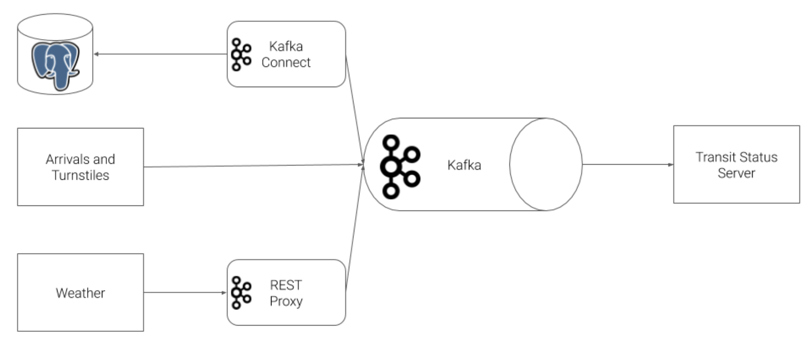

# CTA_realtime_dashboard

### Table of Contents

1. [Installation](#installation)
2. [Project Motivation](#motivation)
3. [Architecture](#architecture)
4. [File Descriptions](#files)

## Installation 

## Project Motivation    
This project is build for Chicago Transit Authority (CTA) to display system status for its commuters.

## Architecture 

## File Descriptions 

